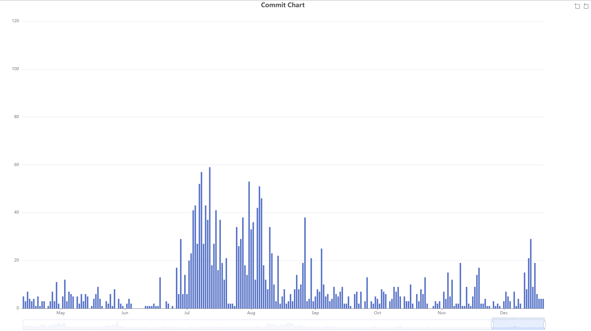
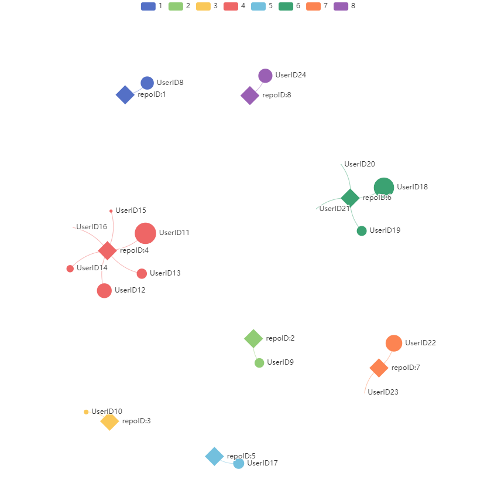
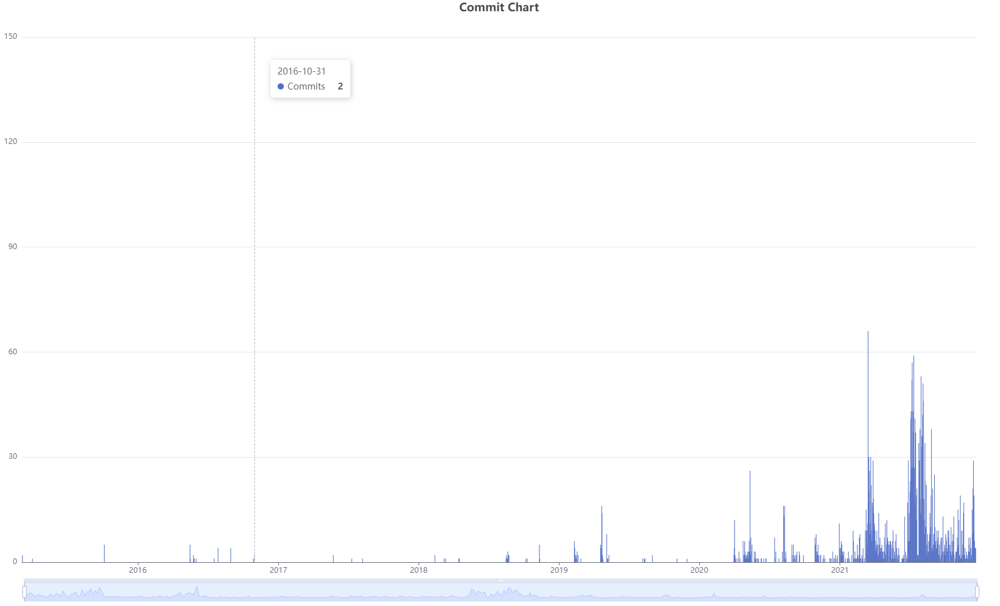
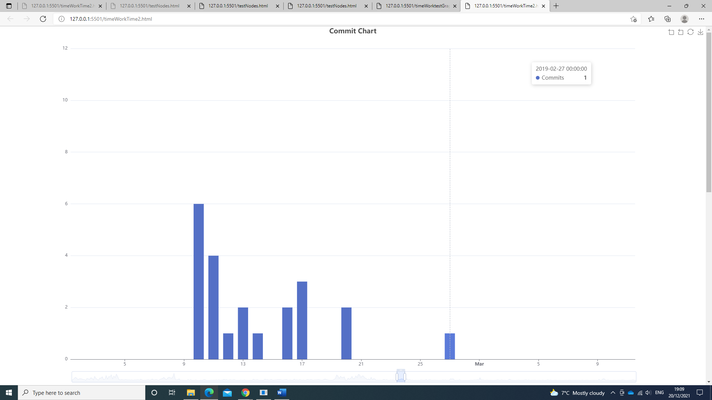
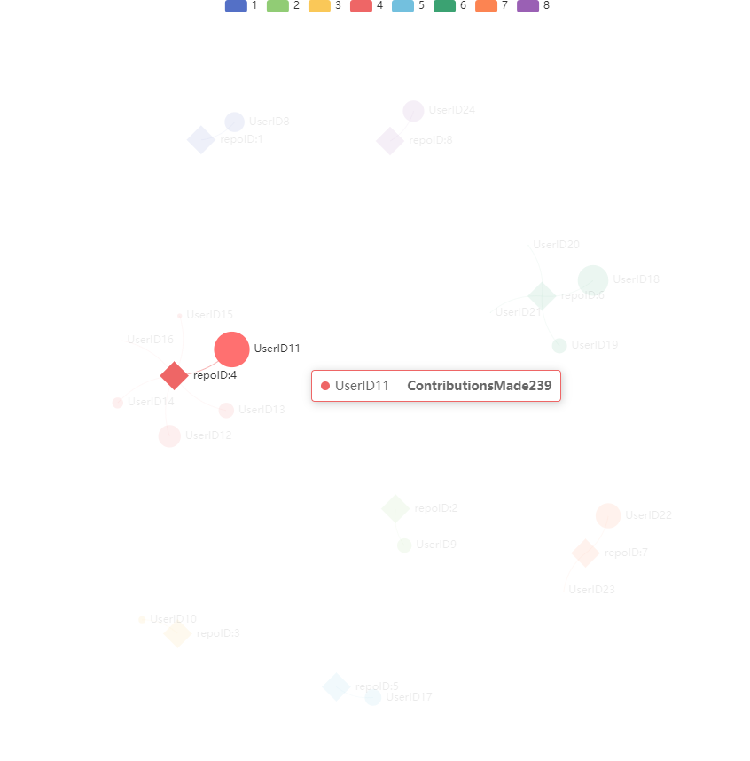

# GitHubAPIVisualisation

Software Engineering Github API visualisation
Due 22nd December

For this project I focused on provididng measurements of all the activity in a user's github account.
It gets a bit messy when the account has extremely large levels of activity but seems to be fine for smaller amounts.
My Visualisation consists of two graphs.

The first is a graph showing every single commit that has ever occurred in a users account.
You can scroll to narrow down the dates or to expand them. You can also use it to see the commits between two specific points in time
It's based on the commits made each day but it is also possible to alter the python code to make it based on commits in an hour

I used data taken from trending repositories on Github but I hid the  user names and repository names and replaced them with numbers for the images shown.

The second graph shows every single repository in the the users account and every single user that has commit to those 
repositories. The size of the the user nodes will scale up depending on the amount of contributions they made.
The size of the nodes is calculated using logarithmic scaling just to stop the issue of one node being several thousand times
larger than a node where a user only made 1 or 2 commits.

Both graphs are interactive. In the first one you can determine the time period of commits you want to see by scrolling or manipulating the window at the bottom
of the graph. In the second graph, you can click categories legend at the top of the graph to make the repository node and all associated users disappear. This allows you 
to look at select repositories at a time. You can also hover over nodes to get additional information

Steps involved in setting this up
Have Python installed on your computer https://www.python.org/downloads/
Have PyGithub installed on your computer with this command "pip install PyGithub"
Download the git repository 
In timeWork2.py and GitHubFile.py put your generated github token and selected username in the GithubWorkObject=Githubclass("token","username") area
Run both of those files. 2 Json files should be created from these files
Then run a python server with "python -m http.server 8000" on your command line or use a different port to 8000
 
open up a web browser and type "http://127.0.0.1:8000/timeWorkTime2.html"  or whatever equivalent port the python server is running
You should now see the two graphs generated from the JSON data

